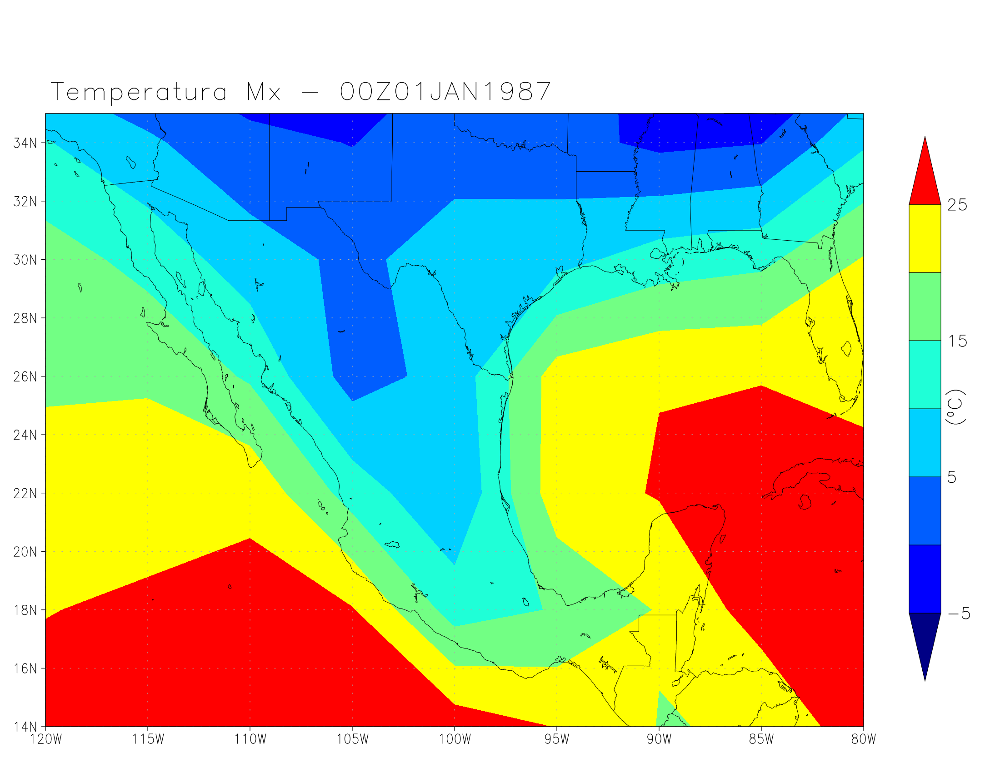

# Repositorio de scripts en GrADS para generar mapas

# Instalación de GrADS

## En Windows

## En Linux

# Hub de Scripts - Índice

| SCRIPT | PRODUCTO QUE GENERA | MUESTRA
|----|-------|--------|
| | Crea un mapa de temperatura para México en 00Z01JAN1987 con datos de entrada de model |  |

